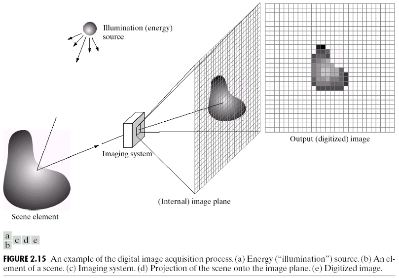
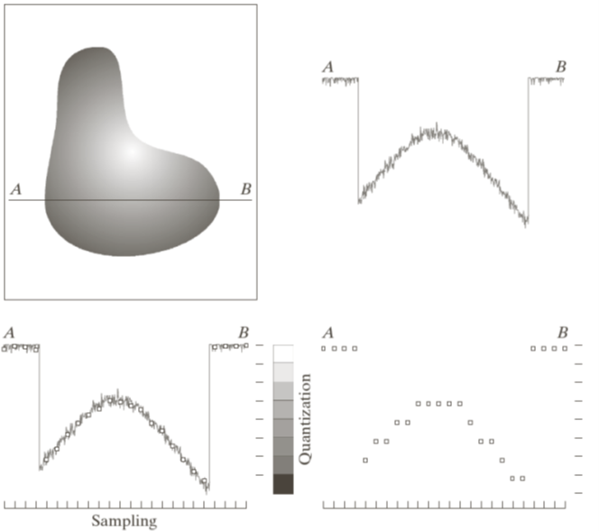
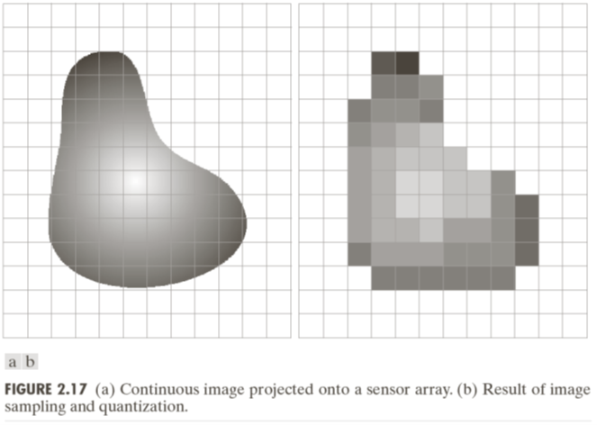

# 数字图像基础知识
<!-- toc -->

## 什么是数字图像
首先，一幅图像可以定义为一个二维函数$$f(x,y)$$，其中$$x$$、$$y$$代表的是空间（当然这里指的是平面）坐标，而$$f(x,y)$$则称为在坐标$(x,y)$出的**强度值**或者**灰度值**。当然，$$f(x,y)$$不一定只输出一个值，它也可以是多通道的。当$$x$$、$$y$$、$$f(x,y)$$的取值都是**离散的有限值**的时候，这个图像就被称为是**数字图像**(Digital image)。也就是说，一个数字图像是由有限数量的元素组成的，这个元素我们通常称为**像素**(Pixel)。
> PS：Pixel其实是Picture element的缩写，也就是“图像元素”，简称像素。

换句话来说，一个数字图像也可以理解为一个$$x\times y$$的二维矩阵，矩阵中的每个元素对应$$f(x,y)$$。

## 为什么是离散的？
数字图像要求$$x$$、$$y$$、$$f(x,y)$$的取值都是离散的有限值，这其实同模拟信号与数字信号有关。通过之后的章节我们可以知道，照射在照相机的传感器上的光信号，以及通过感知光信号而得到的电压信号都是模拟信号，这种模拟信号是连续的。更为广泛地说，大多数传感器的输出都是连续的电压波形，其幅度与空间特性与与所感知的物理现象有关。总而言之，我们得到的输入信号大多是连续的模拟信号。

那么为什么不直接采用这些模拟信号呢？主要原因是模拟信号不利于保存与传输，而数字信号则可以。同时，我们的计算机系统的存储也是离散化的。所以获取图像的方法有很多，但是目的都是相同的，就是从感知到的信号转换为数字信号，以便于我们对其进行分析与加工。

## 采样与量化
要将连续的模拟信号转化为离散的数字信号，需要经过采样与量化这两个步骤。

**采样**(Sampling)指的是在空间域上的离散化，也就是对于坐标$$(x,y)$$进行离散化。**量化**(Quantization)指的是幅度域上的离散化，也就是对于$$f(x,y)$$的离散化。

以上图为例，图(b)中的一维函数是图(a)中沿线段$$AB$$的连续图像幅度曲线。采样指的是在横轴$$x$$上等间隔地取点，这些被取到的点是一组离散的位置。而量化指的是在纵轴$$f(x,y)$$上将幅度值划分为几个范围，在某一特定范围内的幅度值都赋予一个相同的特定值。经过采样与量化之后，一个连续的图像就被离散化为一个数字图像。如下图所示。

