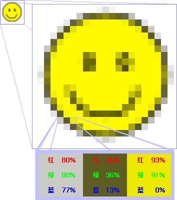

# 图像的基本参数
<!-- toc -->

首先看这样一张图，这是Falcom公司出品的游戏《零之轨迹》OST的封底。打开图片的属性窗口，我们可以看到如下几个参数：

|Property|Value|
|:|:|
|Dimension|1920*1200|
|Width|1920 pixels|
|Height|1200 pixels|
|Bit depth|24|
|Item type|JPG file|

## 位图（Bitmap）
我们所说的位图，就是一个个像素纵横排成阵列所组成的数字图像，每个像素的颜色信息由RGB组合或者灰度值表示。

> 另一种图像的表述方式是矢量图，主要用基于数学方程的几何图元表示图像。特点是文件相对较小，而且任意放大矢量图形，不会丢失细节或影响清晰度。

## 图像分辨率(Image resolution)
我们这里所说的分辨率，指的是一个图像的分辨率，也就是其长宽方向上的像素数量。一般来说，分辨率既可以使用“长$$\times$$宽”的形式来表述，也可以直接采用总的像素数量。例如，常见的按照标准屏幕分辨率分，有$$1920\times 1080$$、$$1650\times 1050$$、$$1366\times 768$$等；按照相机拍摄的分，可以有$$7952\times 5304$$（Sony A7R2，42.4 megapixels）、$$7360\times 4192$$（Nikon D810）、$$4240\times 2832$$（Sony A7S，12.2 megapixels）；也有按照特定的应用分，例如$$500\times 500$$这样的正方形图像。

> 分辨率这个概念比较模糊，除了上面的一种说法表示每一个方向上的像素数量外，还能指代每英寸所含点或像素数，也就是dpi与ppi。具体的差别可以参考[这个知乎问题](http://www.zhihu.com/question/21220154)。

## 位深度（Bit depth）
位深度指的是在位图中，每一个像素所携带的颜色信息的比特数。根据位深度,可将位图分为1、4、8、16、24及32位图像等。每个像素使用的信息位数越多，可用的颜色就越多，颜色表现就越逼真，相应的数据量越大。例如，位深度为1的像素位图只有两个可能的值（黑色和白色），所以又称为二值位图。位深度为8的图像有$$2^8$$（即256）个可能的值。

我们常见的是携带有R、G、B三种颜色通道的图像，也就是RGB图像。一般来说，R、G、B三种颜色通道，每个通道占8bit，合起来总共24bit。一些图像格式支持透明通道，Alpha通道也要占8bit，所以合起来占32bit，称为RGBA图像。

## 图像格式（Image Format）
图像有着不同的格式，这其中主要是由于采用了不同的压缩算法所造成的。压缩可以分为有损压缩与无损压缩，有损压缩指的是在压缩过程中有信息的丢失，解压缩之后无法还原出源图像；而无损压缩则不然。常见的图像格式如下：

| 后缀名 | 简介 |
| -- | -- |
| .bmp | 最常被Microsoft Windows 程序以及其本身使用的格式。可以使用无损的数据压缩。 |
| .jpg | 使用有损压缩，图片品质可根据压缩的设定而有所不同。 |
| .png | 无损压缩位图格式，可携带透明通道。 |
| .gif | 支持动画图像，支持256色，对真彩图片进行有损压缩。使用多祯可以提高颜色准确度。 |
| .tif/.tiff | 大量的用于传统图像印刷，可进行有损或无损压缩。 |
| .eps/.ai/.svg | 矢量图文件格式。 |
| .raw/.cr2/.nef/.dng | 通常为相机所拍摄的无损图像，大部分基于TIFF |

