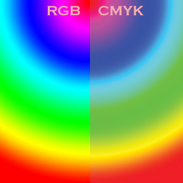
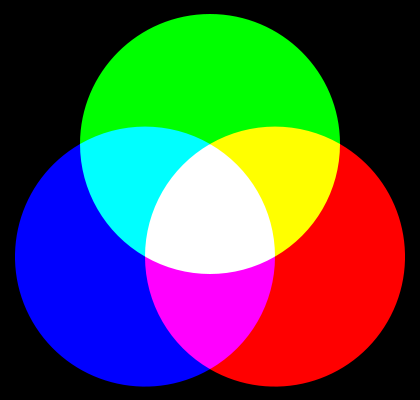
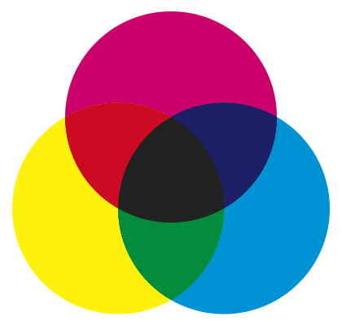
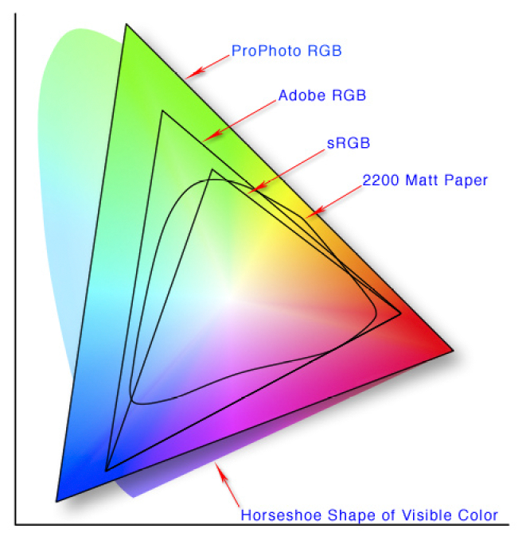

# 色彩与色彩空间
## 基本概念
大家都知道在绘画时可以使用红、黄、蓝这三种原色来画出其他不同的颜色，这三种颜色就定义了一个色彩空间。我们可以以红色、黄色、蓝色分别为X、Y、Z轴，这样就得到一个三维空间，每种可能的颜色在这个三维空间中都有唯一的一个位置。

> 可以将上述的红、黄、蓝类比于线性空间中的基向量，三组正交的基向量就能够表示三维空间中的所有向量。

同样地，在屏幕上显示颜色的时候，通常使用R、G、B（红色、绿色、蓝色）的色彩空间定义，这是另外一种生成各种颜色的方法。

常见的色彩空间有RGB、HSV、YUV、CMYK等。

## 常见色彩空间
### RGB
RGB是最为常用的一个色彩空间，采用的是加法混色。由于与屏幕显示颜色的方法一致，所以使用RGB色彩空间能够大大简化设计与开发流程。
### YUV/YIQ/YCbCr
这是视频记录中较为常见的一类色彩空间。RGB固然流行，但是有时候RGB并不是最为有效率的方法。例如在处理真实世界中的颜色时，RGB每个通道都要有相同的位数来记录颜色，占用的空间大、成本高。同时，在图像处理中RGB也不是最快的，比如修改一个颜色的亮度就需要修改R、G、B三个信息。因此，为了节省带宽以及加快处理速度，YUV这类格式应运而生。

YUV等格式包含了亮度与两个色差信号。其中Y表示亮度（Luminance、Luma），U、V表示色度（Chrominance、Chroma）。通常为节省带宽起见，大多数YUV格式平均使用的每像素位数都少于24bit。这其中主要的抽样（subsample）格式有YCbCr 4:2:0、YCbCr 4:2:2、YCbCr 4:1:1和YCbCr 4:4:4。

* 4:4:4表示完全取样。
* 4:2:2表示2:1的水平取样，垂直完全采样。
* 4:2:0表示2:1的水平取样，垂直2：1采样。
* 4:1:1表示4:1的水平取样，垂直完全采样。

以下分别是源图像、Y、U、V。

### HSV/HSB/HSL
HSV（色相Hue，饱和度Saturation，明度Value），有时也称HSB（明度Brightness），是一种用色相，饱和度等概念描述色彩的更自然直观的概念。

HSL（亮度Lightness/Luminance），也称HLS或HSI（亮度Intensity），与HSV非常相似，仅用亮度（Lightness）替代了明度（Brightness）。二者区别在于，一种纯色的明度等于白色的明度，而纯色的亮度等于中度灰的亮度.

### CMYK
CMYK（青色Cyan，品红Magenta，黄色Yellow，黑色Key(Black)）是一种常在印刷过程中使用的色彩空间，采用减法混色法。彩色印刷时采用的一种套色模式，利用色料的三原色混色原理，加上黑色油墨，共计四种颜色混合叠加，形成所谓“全彩印刷”。

> **加法混色法**：描述各种“光”通过何种比例来产生颜色。光线从暗黑开始不断叠加，产生颜色。RGB描述的是红绿蓝三色光的数值。

> 

> **减法混色法**：一般来说以反射光源或颜料着色时所使用的色彩是属于“消减型”的原色系统。因为它描述的是需要使用何种油墨，通过光的反射显示出颜色。它是在一种白色介质（画板，页面等）上使用油墨来体现图像。由于印刷颜料的限制，单单使用黄色、青色、品红三种原色无法调出纯正的黑色，只能呈现浊褐色，所以在这一套“三原色”的基础上增加黑色，形成CMYK。CMYK描述的是青，品红，黄和黑四种油墨的数值。

> 

## 色域
色域是对一种颜色进行编码的方法。绝大多数系统的色域都是由于很难生成单色（单波长）的光线所导致的。最好的接近单色光的技术就是激光，对于大多数系统来说这种方法过于昂贵，不太现实。随着激光技术的进步，成本进一步降低，这种方法也逐渐有所应用。除了激光之外，大多数系统都是用大致近似的方法表示高度饱和的颜色，这些光线通常包含所期望的颜色之外多种颜色。

使用加性色彩处理的系统通常在色域饱和平面上大致是一个凸多边形。多边形的顶点是系统能够产生的最饱和的颜色。在减性色彩系统中，色域经常是不规则区域。

常见的色域有sRGB、AdobeRGB等。一般来说，使用sRGB。

