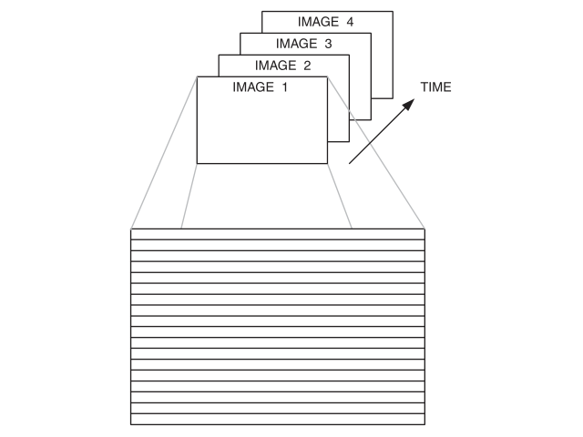
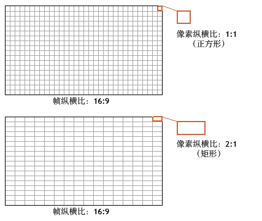
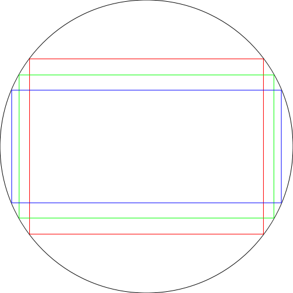
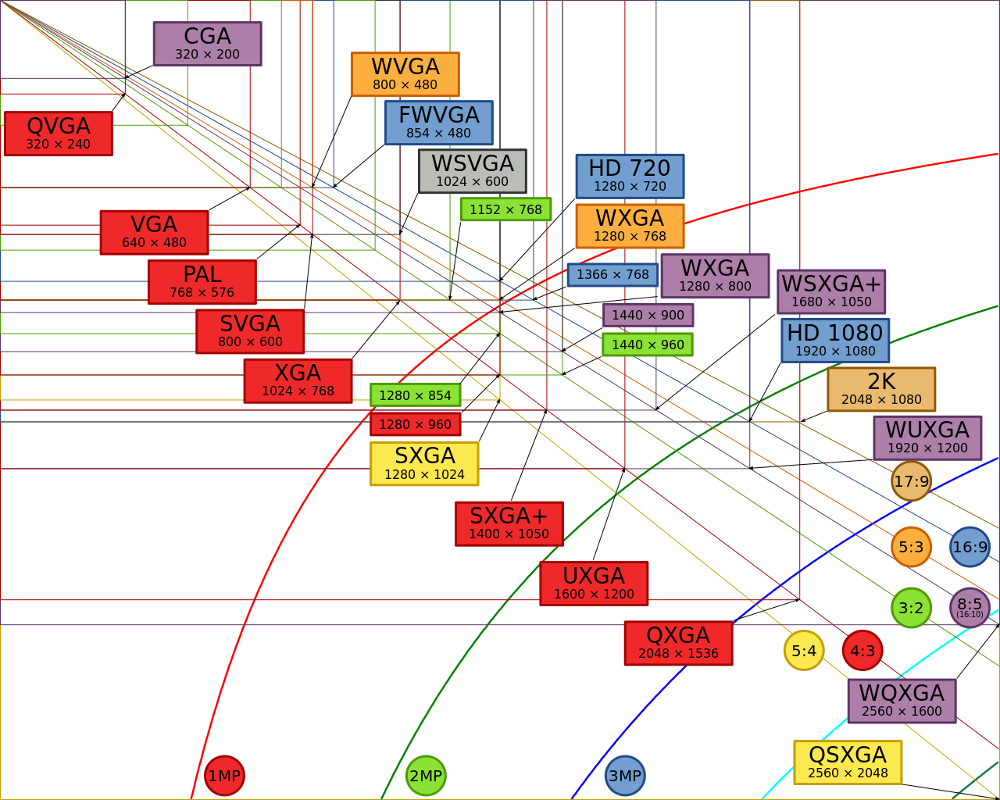
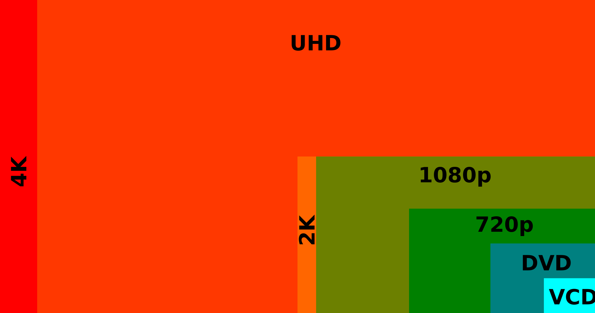
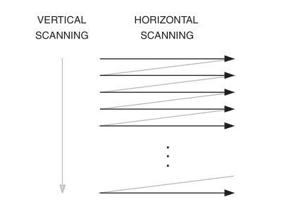
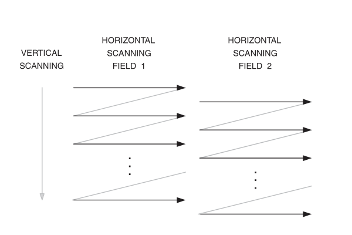
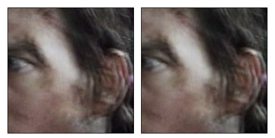

# 视频基本概念
## 动态图像
虽然视频看起来像是连续的，但是事实上是由一系列的静态图片随着时间所串联起来的。这些静态图片进行很快的切换，由于人的视觉暂留效应，所以看起来像是在连续地动。

> **视觉暂留（Persistence of vision）**：是光对视网膜所产生的视觉，在光停止作用后，仍保留一段时间的现象，其具体应用是电影的拍摄和放映。原因是由视神经的反应速度造成的，其时值约是1/16秒，对于不同频率的光有不同的暂留时间。是动画、电影等视觉媒体形成和传播的根据。通常，在电影与动画工业中，认为人眼分辨不出25Hz以上的变化。

### 帧与帧率
对于连环画来说，一**帧（Frame）**就是指某一页的图画。对于早期电影工业来说，一帧就是一条胶卷上的一格画面。而在数字时代，一帧则是指视频某一时刻的静止图像。

一般来说，视频就是由帧所组成的，少则几十，多则上万。在一些视频后期软件中，帧也是时间轴的自变量。

显然，就算我们有了一段视频所有的帧，我们也不能进行观看——因为只有当帧按照一定频率出现时才是动态图像。这就引入了**帧率（Frame Rate）**的概念。帧率的单位是Frame per Second，也即帧/秒，表示一秒钟有多少帧出现（也意味着每帧出现的时间为 1/fps 秒）。
### 宽高比与分辨率
宽高比即视频的宽与高的像素数量之比，有时也称长宽比。一般来说，我所讨论的宽高比都是**显示宽高比（Display Aspect Ratio，DAR）**，即最终显示在屏幕上的宽高比例（包括视频文件带有的黑边）。而**像素宽高比（Pixel Aspect Ratio，PAR）**则是另外一种概念：像素宽高比指的是像素本身的宽高比。例如我们常说的像素的长宽比为 1:1，故也被称为方形像素。除此以外，还有 1.333:1的长方形像素（出现在HDV摄录和一些 HDTV制式中）等。

> 例如，部门的1000c使用HDV 1080制式拍摄的时候，传感器的分辨率其实只有$$1440\times 1080$$，但是由于传感器的像素宽高比是1.333:1，所以最终采集到的视频分辨率是$$1920\times 1080$$。

在电影工业中，常见的宽高比有16:9、4:3、2.35:1、1.85:1等。如下图，蓝色框表示宽高比2.35:1，绿色框表示16:9，红色框表示4:3。

分辨率方面，常见的有480p、720p、1080p、2K、4K甚至8K。其中，480p、720p、1080p的名字取决于其纵向像素的数量；而2K、4K、8K的得名取决于其横向像素的数量。

2K一般指$$2048\times 1080$$的分辨率。下图是2K以下的分辨率及其英文名。值得注意的是，HD 1080又称Full HD，

4K一般有$$3840\times 2160$$和$$4096\times 2160$$像素2种规格，有时也被称作是2160p。

### 隔行与逐行扫描
要显示视频，就要按照帧率在屏幕上不停地刷新出新的画面。通常，显示器显示某一帧的时候，是按照从上到下，从左到右的顺序，一行一行地显示。这样的方法被称为**逐行扫描（Progressive Displays）**。

但是在早期的模拟电视广播中，由于当时的技术不能实现如此快的刷新率（60Hz或50Hz），所以采用了**隔行扫描（Interlaced Displays）**的方法。隔行扫描指的是将每一帧的画面按照奇偶行分为上下两个**场（Field）**，每一帧只显示一个场，也即二分之一个完整的帧的行数。由于视觉暂留效应，人眼不会注意到两场只有一半的扫描行，而会看到完整的一帧。这样做的好处是极大地减少了带宽，降低了局部的刷新率。也就是说，整个图像的刷新率是60/50Hz，而局部（每条线）的刷新率降到了30/25Hz。

当然，隔行扫描的方式存在着不少缺点。首先是由于相邻的场被拍摄的时间并不相同，相邻的两个场并不能完美的结合在一起；因此若是在使用渐进式扫描的显示器上播放交错式影像，在画面中有移动的部分将会产生横线的锯齿状线条。若是两个场刚好是场景交换，那么会出现两个场景同时出现的鬼影现象。因此在这种情形下需要去交错来将交错式影像转换为渐进式影像。下图中，左为隔行扫描，右为逐行扫描。

其次，另外在影像中若是有细小的横向线条，线条的高度差不多就是一行扫描线左右，那么会出现在这个场这条横线会出现，但是下个场却又消失，人们看起来这条横线是在“颤抖”的现象。例如：屏幕上的小字体的横向笔划或是远方穿着横向条纹衣服的人物。针对这种现象，通常会加入一个低通滤波器（low pass filter，LPF）去将这些高频的部分滤除掉。但是这将使得画面看起来比较模糊。

随着当代采集以及显示技术的提升，隔行扫描逐渐被逐行扫描所替代，但是，很多HDTV信号仍旧使用隔行扫描来进行传输。

> 对于NTSC制式来说，每秒59.94场，而PAL制式是每秒60场。在PAL制式和NTSC制式中，都是先扫描奇数行，即奇数场。

> 通常有一种误解是，偶场和奇场是由同一帧分拆得来的。实际上，摄像机采集的方式和隔行扫描显示的方式是完全相同的。当摄像机采集图像时，偶场和奇场不是同时采集的。例如在一个每秒50场的摄像机中，第122行和124行的采集在第121行和123行的采集大约1/50秒之后进行。所以如果把一个偶场和奇场简单的拼合在一起，水平方向的运动会造成两场边界上不能完美的拼合。

## 视频压缩
我们知道未压缩的视频文件需要占用大量的带宽和空间。例如，使用After Effects渲染一个几十秒的Uncompressed AVI，得到的文件体积是十几G。那么，是不是有方法能将视频文件变成体积更小的文件呢？

为了实现上述的目标，人们发明了一些特殊的方法用来尽量减小信息的体积，或者转换成更容易表达的方式，这就是信息压缩。压缩的方法有很多种，例如1000000000000可以被描述为$$10^{12}$$。对于视频来说，类似这样的方法被称为编码方法或编码方式，一般称为编码（Code & Codec）。而对这些东西进行加工的过程则被称为**编码（Encode）**。例如常用的“邮编”就是邮政编码，用6位数字用来表示地区。

而对于视频文件来说，如果视频文件不是未压缩的，那么视频文件应当是按照某种编码（如Advanced Video Codec，AVC）进行了编码并存放为对应的文件。如果想要打开这个视频，考虑到显示设备无法识别这种编码，那么你就需要对这个视频文件进行**解码（Decode）**，这样就可以获得无压缩的信号并且可以将它传送到显示设备上。而将一个视频从某种编码转换成另外一种编码这种行为，我们称之为**转码（Transcode）**。

通常而言，对于视频采用的压缩原理可以分为两种：帧内压缩与帧间压缩。

* 帧内压缩：与单个静止图像的压缩原理相同，与前后帧无关。
* 帧间压缩：识别帧与帧之间的差异，并且仅存储差异，因此所有帧将根据其与前一帧相比的差异来进行描述。不变的区域将重复前一帧。

当然，最新的视频压缩还采用了更为先进的运动预测、可变长编码单元等技术。

### 无损编码（Lossless compression）
如同图像有无损压缩一样，视频也有无损编码。顾名思义，无损编码就是在不对画质造成损坏的情况下对视频进行一次编码。其应用常见于调色，获得带 Alpha 通道的视频等。
这种编码有很多，而且存在多种编码的算法。下面列举一些常见的编码：

* PNG Sequence
* JPEG2000 Sequence
* H.264 lossless
* Animation (qtrle)
* Lagarith Lossless Codec
* Huffyuv
* FFV1
* UT Video
* MSU Lossless Video Codec

> 可以看出，前两种无损压缩方式其实是将视频内的每一帧都变成了无损压缩的图片序列。这也是一种很常见的方式。

> 视觉无损：实际上，并非所有的无损编码都是信息上完全无损的。在RGB 到YUV和YUV到RGB的转换中，实际上存在画质的损耗（浮点数转整型产生的损耗，也即量化噪声）。但是这种损耗往往是人类视觉难以觉察的。因此，在有些编码采用不同的色彩空间时会产生视觉无损的损耗。有时候 JPEG Sequence的文件（或其他类似的）也会被称作视觉无损，但产生损耗的原理和上述有所出入。

### 有损编码（Lossy compression）
虽然人们一直在追求无损的同时降低体积。但是很快工程师和科学家们发现遇到了瓶颈。而且，在实际应用中，视频的编码输出并不需要那么高的质量，相反，体积才是主要矛盾。为了解决此矛盾，有损编码的应用也就诞生了（事实上，有损编码在很早的时候具有应用了）。

有损编码的种类比之无损编码要多得多。但是随着技术的进步，优秀的和常见的有损编码集中体现在为数不多的几种，例如MPEG-2 Part 2, MPEG-4 Part 2, H.264 (MPEG-4 Part 10), HEVC, RealVideo RV40, VP8, and VP9等。以下只介绍H.264编码，其余编码方式将在下一节中进行叙述。

#### H.264/MPEG-4 AVC
H.264 得名于 Rec. ITU-T H.264（国际电联电信标准化部门H系列（试听与多媒体系统）第264号议案），而 AVC 的名称来自于 ISO-14496-10，也即 MPEG（Motion Picture Expert Group）4-Part10 的标题：Advanced Video Codec。实际上，这两者使用的是同种编码。由于具有良好的兼容性和规范性，再加上具有极为优秀的画质压缩率比，H.264/AVC 成为了目前绝大部分
视频的通用编码。

H.264/AVC有着多种编码器，不同的编码器有着不同的性能。下面会对这些编码器做一些介绍：

* x264：是目前性能最好的开源H.264编码器，不仅具有极高的画质压缩比，而且也具有很高的可调性：能够调节码率大小，画质好坏和编码速度等。目前 x264 的编码平台包括 MeGUI，TMPGEnc，ffdshow，ffmpeg等。

* MainConcept H.264 Encoder：十分优秀的H.264编码器，具有不错的画质压缩比。在许多商业软件如Adobe门下的产品以Sony Vegas Pro等都采用了MainConcept 作为其H.264编码器的一种。

* Quicktime H.264：常见于在iTunes发布的电影预告片和大量.mov 封装的H.264视频文件。

## 视频制式