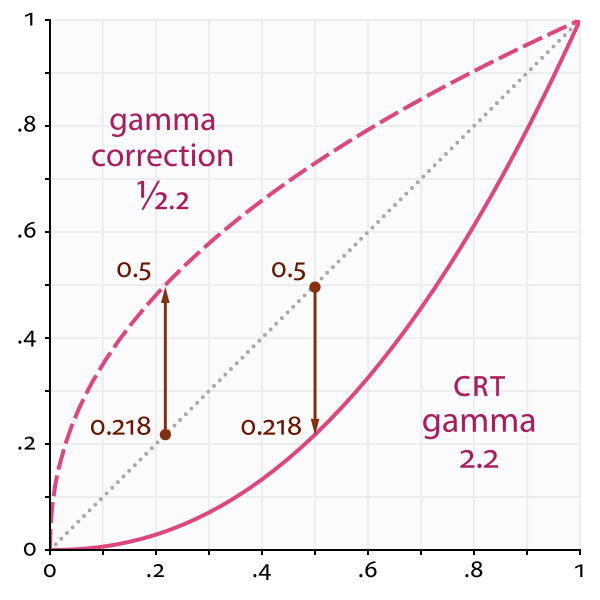
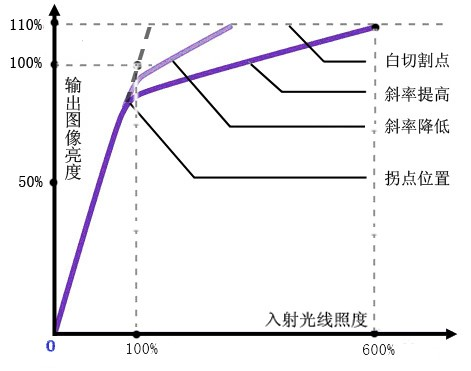
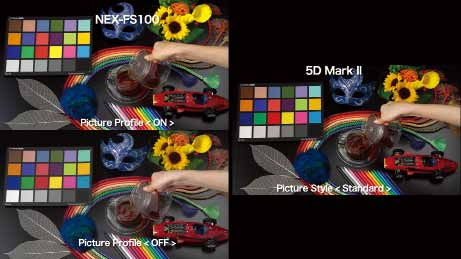
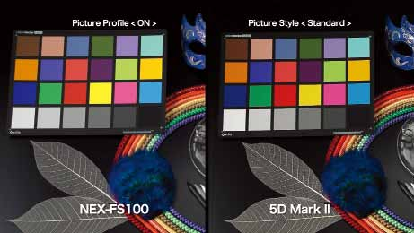

# 索尼FS系列摄像机技巧
[toc]

## PICTURE PROFILE
本内容部分引自《索尼35mm影像世界》，侵删歉。
### 什么是 PICTURE PROFILE?
PICTURE PROFILE是一个菜单，专门用于调整和改变画面特性。有很多可以调整和改变的参数，他们可以归结为四种类型——用于选择基本色调的参数，用于调整灰度（黑白色调）的参数，用于调整色彩的参数，以及用于校正白平衡的参数。

用户可以按下NEX-FS100CK上的PICTURE PROFILE按键，直接进入PICTURE PROFILE设置模式。它的PICTURE PROFILE菜单可调整多种设置，能够与高级的摄录一体机相媲美，用户可改变多种设置，如伽玛曲线、彩色和细节。内部存储中存储从PP1到PP6的六套设置组合。

#### 使用 PICTURE PROFILE 与使用非线性视频编辑软件进行画面处理的差别
PICTURE PROFILE功能可以在记录时调整画面的色彩和清晰度。在拍摄完成以后，用户也可以使用非线性编辑软件进行类似的调整。但两种调整之间也有区别。

为了在有限的内存空间内储存大量图像数据，大多数摄录一体机都会在记录时对图像数据进行压缩。无论压缩格式如何先进，压缩都会使画面质量不可避免地下降。使用非线性编辑软件对已经降级的画面的添加明锐度、伽玛曲线校正和其他视频特效，会进一步降低画面质量。例如，如果视频压缩使得画面对比度很差，一些区域出现了噪波，这时候如果添加视频特效，会使得问题更为明显。

由于PICTURE PROFILE功能是在进行压缩之前处理视频信号的，因此可以在画面质量被压缩过程破坏前改变伽玛曲线和校正色彩。

这样，就能在保持拍摄目标质量不下降的前提下，对画面进行高精度的调整。需要特别说明的是，一定要用在记录画面时使用合适的对比度。如果暗部和亮部区域的对比度记录的不正确，曝光不足的黑暗部分和曝光过度的白色区域就不会有灰度分级。如果这样，用户无论采用什么方法，也无法使用非线性编辑软件在后期改变画面的对比度，因为画面中已经没有可供操作的灰度分级了。

即使用户希望使用非线性编辑软件在后期来处理视频，也需要使用正确的方法来记录画面——这一点很重要。非线性编辑软件是一种很强大的工具，但是它并不是万能的。如果用户调整各种设置，确保视频以接近最理想的方式记录下来，那么他就会得到一个最接近理想状态的视频，只需要使用非线性编辑软件进行少量处理就可以了。这样，就缩短了交付时间，使视频编辑工作更加高效。

#### 最大化发挥 PICTURE PROFILE 功能的重要信息
##### 伽玛曲线(Gamma Cureve)
伽玛曲线显示的是输入信号电平和输出信号电平之间的关系。摄像机将拍摄目标的亮度信号转换成电子信号，并将这路电子信号发送给监视器，随后，监视器再将这个信号转换回亮度信号，还原成拍摄目标的画面。

输入信号电平是指拍摄目标和整体原画面的亮度信号等级，输出信号电平则指摄像机或监视器输出的亮度信号等级。

为了忠实地以视频画面形式还原拍摄目标，输出信号电平需要最大化地与输入信号电平相符，正如下方的直线所示。但是显像管监视器采用的荧光材料会导致显像管监视器输出的信号电平形成一条曲线（如下所示）。这条曲线代表显像管监视器的伽玛曲线（红色曲线）。对称的另一条曲线（蓝色曲线）为摄像机的伽玛曲线。因此，摄像机和显像管监视器的伽玛曲线会使原拍摄目标的还原和显示发生偏差。现在，采用液晶、等离子和有机发光二极管“（OLED）”技术制造的监视器已被广泛采用。由于这几种监视器的伽玛曲线特效与显像管监视器不同，国际电信联盟“（ITU）”采用广播和视频还原的2.4（ITU-R BT1886）来设置监视器的伽玛值。这数值将使用在广播和视频还原的，真正的显像管主控监视器的伽玛曲线考虑了进去，接近2.4，而不是理论数值2.2。

索尼的液晶和OLED监视器可让用户选择与传统显像管监视器最接近的伽玛曲线，以便能够从旧系统更加平稳地过度。

##### 拐点(Knee)
在拍摄亮度反差极大的场景时，摄像机无法拍摄出清晰的画面，比如耀眼阳光下和阴影中的物体。如果针对阴影中的目标调整光圈，设置正确的曝光，那么阳光下的物体就会显得过于明亮，呈现出一片没有纹理和分层的白色。

在拍摄这种标准范围视频信号电平中带有大跨度亮度电平的画面时，拐点校正是一种必须的功能。在黑伽玛影响黑暗画面区域的对比度时，拐点校正则对带有高亮度电平画面区域的对比度进行修正。CCD和CMOS成像器可以处理亮度极高的输入信号。但是，为了将这种信号以视频信号的格式进行输出，我们需要使这种信号维持在标准的视频范围内。在下方的表格中，高亮度范围的直线呈现出像膝盖一样的拐弯。这个拐弯的点就称为拐点。从拐点延长出来的线叫做拐点斜率。通过改变拐点的位置和斜率，就可以改变高亮度范围的对比度。

系统可处理的输入信号电平范围称为动态范围。输入信号应处于动态范围109%（白切割点）范围内。

### PICTURE PROFILE 设置
#### 预置PP设置
NEX-FS100CK 摄录一体机带有多个 PICTURE PROFILE 出厂预设。使用这些预设，用户可以将画面的与其他型号的摄录一体机相匹配，或制作出类似于电影的图像风格。

| 预设 | 说明 |
| -- | -- |
| PP1, PP2 | 相当于 PICTURE PROFILE=OFF 的标准设置 |
| PP3 | 模仿索尼公司广播级摄录一体机画面性能的设置。相当于 HXR-NX5 的 PP3 |
| PP4 | 符合 ITU-709 标准，忠实于原色彩的设置。这是率先由 NEX-FS100CK 配备的，新型的设置方式 |
| PP5 | 类似于电影负片的画面风格设置 |
| PP6 | 类似于放映用电影胶片的画面风格设置|

#### 基本颜色的设置
具体的设置有伽玛、彩色模式、黑电平、黑伽玛、拐点、彩色电平、彩色相位、彩色深度、细节、白平衡等选项。本文不一一详述，想要更加详细的解释，可以参见FS100/FS700的使用说明书以及索尼出品的《35mm影像世界》。

对于拐点，总体来说，拐点应设置在85%到100%的范围内，这是与人皮肤亮度水平匹配的数值。

拐点和拐点斜率应被作为一个整体看待。大体上说，如果需要拍摄普通视频效果的高明锐度画面，可将拐点设置为较高值，拐点斜率设置为较平缓。如果需要让画面表现出类似电影的效果，可将拐点设置为较低值，拐点斜率设为较陡直。实际拍摄中，在检查高亮区域灰度等级的时候，应将拐点和拐点斜率向相反的方向上下移动，直至找到合适的设置。

#### 将色调与其他型号匹配
使用 PICTURE PROFILE 功能，可将不同的摄像机与 NEX-FS100CK 摄录一体机同时使用，采用色调和虚化特效，打造属于自己的创作空间。例如，用户甚至能够制作出佳能 5D Mark II 单反摄像机特有设置才能制作出的独特色调。

在上面的图像范例中，两个图左下方图片都是采用 NEX-FS100CK 的初始设置（PICTURE PROFILE = Off）拍摄的，它们右侧的图案是使用 5D Mark II 摄像机拍摄的，可以看到，他们之间的色调差异很大。但是两个图片中左上方的照片色调与右侧照片非常接近，这说明通过调整 PICTURE PROFILE 设置，可以将 NEX-FS100CK 的色调与其他摄像机相匹配。

进行这种调整时，需要一个经过精密校准的画面监视器，以及一个色彩表和灰度表。如果能够在观看波形图 / 矢量监视器时进行调整，完成任务时就能节约大量的时间。

供参考：用来将NEX-FS100CK色调与Canon 5D Mark II进行匹配的PICTURE PROFILE设置如下所示。请注意：由于拍摄环境不同，实际色调可能会有所差异。因此，建议将数据作为起点使用，自己再进行进一步调整。

| 选项 | 属性 |
| -- | -- |
| 黑电平 | –15 |
| 伽玛 | ITU-709 |
| 黑伽玛 | 范围：低；电平：+4 |
| 拐点 | 手动；点：75%；斜率：0 |
| 彩色模式 | ITU-709 矩阵；电平：+1 |
| 彩色电平 | +3 |
| 彩色相位 | –4 |
| 彩色深度 | RGBCMY：-374675 |
| 细节 | +7 |
